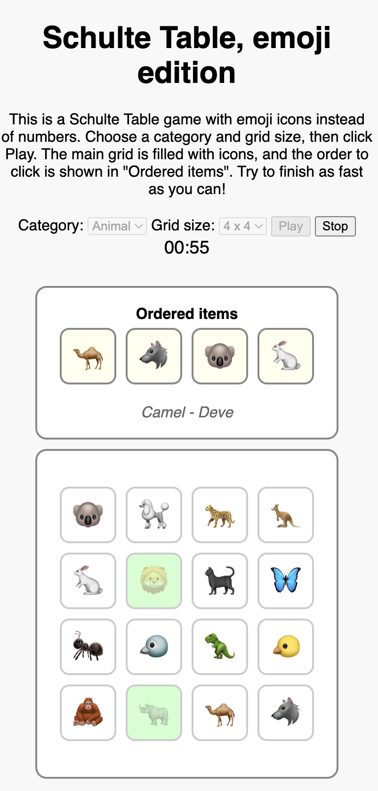

# Schulte Table, Emoji Edition

This is a Schulte Table game with emoji icons instead of numbers. The game is designed to be fun and engaging, with a focus on improving visual attention and quick decision-making.
You can play the game online at the following URL:
[Schulte Table, Emoji Edition](https://dmitriik.github.io/copilot_playing_around/schulte_table.html)

## Gameplay Summary
- The game consists of a square grid of buttons (the main grid) filled with emoji icons from a selected category (e.g., animals, food, or sports).
- At the top of the game field, there is a row called "Ordered items," which displays the sequence of icons to be clicked in order.
- The main grid is populated with icons when the page loads, while the "Ordered items" row starts empty and is populated when the game begins.
- Players must click the icons in the correct order as shown in the "Ordered items" row. Correct clicks update the row, and incorrect clicks briefly flash red.
- The game ends when all icons are clicked in the correct order.

## Features
- **Customizable Grid Size:** Choose grid sizes from 4x4 to 6x6.
- **Category Selection:** Select categories like animals or food for the emoji icons.
- **Bilingual Labels:** Displays the name of the current item to be found in both English and Turkish.
- **Timer:** Tracks the time taken to complete the game.
- **Play/Stop Buttons:** Start or stop the game at any time.

## Screenshot

## Credits
This game was created with the help of GitHub Copilot, showcasing the power of AI-assisted coding.

